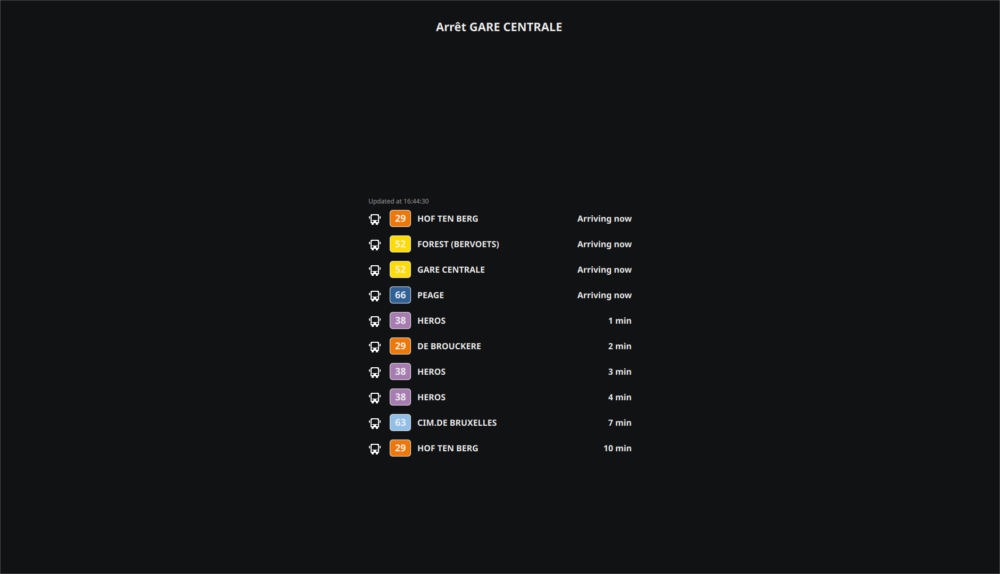

# STIB Panel

Display the next arriving bus/tram/metro at a chosen station.



## Usage

First, install the dependencies
```
pip install -r requirements.txt
```

Then, simply set the env variables and run the script :
```
STIB_API_KEY=your-api-key BUS_STOP=ULB python3 main.py
```

## Build

To build the app
```
./build.sh
```
It will output the binary in ./dest/ and copy the QML folder with it.
The binary needs the QML folder to work.

To clear the build, you can use
```
./build.sh clean
```
*NOTE* : it will remove the directories AND the binary.

## Hyprland

Sometimes QT apps can fail at start on hyprland, to "fix" it run the script `hyprland.sh` that sets QT env variables. (You still need to put env variables for api key and bus stop)